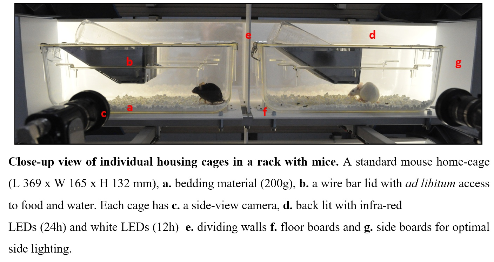

# DeepEthoProfile

Software to automatically annotate mouse behaviours inside a home cage.
The solution is based on a CNN that processes video recordings and classifies each frame with one of eight first order behaviours

The system was tested to work on a computer running Ubuntu (24.04 or newer) with a NVidia(c) graphic card and CUDA(c) drivers installed. 
Other required software dependencies are: Docker(c) 20+, Python 3.8+, and PyQt 5+

## Instalation
git clone 

#### Create the Docker image containing the undelying framework 
sh DockerBase.sh

#### Create the Docker image for the processing software and download the trained model
sh Docker.sh

#### Start the application
sh DeepEthoProfile.sh

## Usage

#### Add Video 
- select a single video and offers the possibility to visualize it before adding it to the processing queue[Figure]
#### Add multiple videos 
- select multiple videos and add them to the processing queue [Figure]

The results will be saved at the location of the source video as a .CSV file. 
This file contains a header describing the significance of the numbers and a the software version used.
Each line contains the results for one frame: the frame number, the annotation code, and the azquisition time relative to the start of the recording.
The annotation code is a number that corresponds to the automatically annotated behaviour as defined in the header.

## File structure

#### Root folder
Contains the scripts for generating the Docker images and starting the application
Also here are the auxiliary software that were used to perform the video acquisition (Capture) and the manual anntotaion (VideoAnnotationViewer) 

#### nn folder
Contains all the processing, training and testing implementation.
The current version of the trained model will also be downloaded here. 
#### ui folder
Contains the files needed for the user interface

#### docs folder
Contains the generated documentation. 

## Implementation details
A documentation of the source code can be found here: https://deepethoprofile.readthedocs.io

Read the paper [link] for more details about the project.

## Training data
For this study we developed a mobile and compact acquisition system that records long-term behavioural video data from ten mice in parallel. 
 

10 individual mice were recorded, 5 black (C57BL/6) and 5 white (SWISS), for more than 2 days.
For the manual annotation three or four of these 6h videos were selected for each of the 10 mice so that the material for annotation was evenly distributed over the recording period. The annotation was then performed for the 5-minute intervals at the beginning of each half hour.

Two trained biologists annotated half of the data each. Every frame was annotated with one behaviour. At the end the database contained 3,240,000 annotated frames, which corresponds to 36 hours of video. At the end the database contained 3,240,000 annotated frames, which corresponds to 36 hours of video.

The animals observed were five black females of the inbred strain C57BL/6NHsd (from Envigo) and five white females of the inbred strain RjOrl:SWISS (from Janvier). The animals were 13 months old at the time of video recording.   

The manual annotation was performed using a frame accurate software developed in C# that can be found [here](VideoAnnotationViewer). This tool allows frame by frame play, navigation and annotation, and saves the results in a CSV file.

The full manual annotated database can be found <a href="https://zenodo.org/record/7414553">here</a>.

## Training
Training and testing on other videos can be performed using the TrainModel/TestModel files found in the nn folder.

## License:
This project is licensed under the GNU General Public License v3.0. Note that the software is provided "as is", without warranty of any kind, express or implied. If you use the code or data, please cite us!

## Versions:
0.4

## Acknowledgements:
Support for this work was received through the BMBF program “Alternatives to animal experiments”. 
